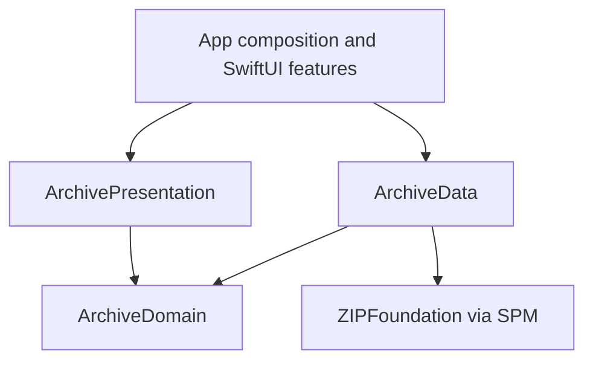

# Architecture and conventions

Copyright © 2026 Vladimir Uvarov. All rights reserved.

ApexArchive uses SwiftUI with main-actor Observation models and a local Swift package. It targets iOS 17+ with Swift 6 language mode. The design keeps UI decisions close to features and puts replaceable I/O behind narrow contracts.

## Responsibility and ownership

`AppDependencies` constructs the object graph once. Feature views receive their models; they do not instantiate networking or persistence services. Domain and presentation modules cannot import ArchiveData or SwiftUI. Concrete repositories are selected at the app boundary.

`ArchiveStore` owns the current validated snapshot and its loading/error state. Refresh failure retains prior content. A request identity prevents a late load from overwriting a newer result, including the offline bootstrap. Driver detail, discovery, search and sorting read that shared snapshot, so an open detail screen sees updated totals without a second statistics cache.

`FavoritesController` owns saved identifiers and persistence failure recovery. `PhotoLibrary` coordinates photo requests and holds a bounded cache. Each `PhotoLoadState` is independently observable: a completed image should not invalidate every card. Views release their prepared image when they disappear. Unavailable licensed metadata and transient request failures are separate outcomes.

## Boundaries and extension points

The domain contracts describe archive loading, photo lookup and favorite storage independently of implementations. Archive loading returns one complete snapshot or throws; providers must not publish partial records. Photo lookup returns nil when no permitted image is available and throws for transport/decoding failures. Adapters and test doubles preserve these semantics.

The data layer separates HTTP transport, ZIP entry reading, provider DTO decoding, snapshot mapping and disk caching. `F1DBSnapshotMapper` converts already-decoded values without network or file access. The cache decorators compose around repository contracts, allowing caching policy to change without modifying feature models. Value types are preferred for data and transformation; actors isolate asynchronous services.

There is no general service locator, global mutable app state, base view-model hierarchy or use-case class for each button. New protocols should represent a real substitution boundary. New features should reuse the shared domain snapshot where their data already exists. Text matching goes through `SearchQuery` so every search folds case and diacritics the same way; a view must not hand-roll `contains` over model fields.

## Folder and naming rules

- App composition and navigation: `ApexArchive/App`.
- Screen-specific UI: `ApexArchive/Features/<Feature>`.
- Shared visual components and named layout values: `ApexArchive/Design`.
- Domain models, contracts, search and validation: `ArchiveDomain`.
- Provider implementations: `ArchiveData/<Provider>`, with wire models in `DTOs`.
- State and user actions: `ArchivePresentation/<Feature>`, named to match the app feature folder it serves.
- Presentation state shared by several features: `ArchivePresentation/Shared/<Concern>`.
- UI-only extensions on domain types: `ApexArchive/Design/Extensions`, never beside a single feature.
- Tests mirror their module, with dedicated test doubles and test-only resources.

Each owned Swift file has one primary type and the same filename. Related extensions may share that file; private nested CodingKeys describe the owning Codable type. Provider JSON spelling is mapped to Swift-style property names. Types communicate their role: Repository for data access, Mapper for transformations, ViewModel for feature state, and View for rendering.

Use descriptive names over comments that repeat the code. Shared visual dimensions live in DesignTokens; protocol-level limits live beside the implementation they constrain. Interface copy uses stable localization keys. Third-party copyright notices retain their original authors.

## Verification

Unit tests focus on behavior: validation, cancellation and ordering, offline recovery, saved-state consistency, sorting, photo permissions and observation isolation. Project validation checks stale source references, missing package associations and Debug architecture alignment with Swift packages. CI builds the complete iOS app and assets after package tests and strict formatting/lint checks. See `VALIDATION.md` for what has actually run locally and what still requires simulator verification.

## Photo lifecycle and motion

`PhotoRepository` exposes cached reads separately from remote resolution. Cache-only methods return nil by default and must never contact the network. `CachingPhotoRepository` decorates the Wikimedia adapter; `FilePhotoCache` isolates disk work in an actor. SHA-256 filenames key image bytes by their full URL and attribution by page title. Successful lookups replace metadata; a successful nil result removes stale metadata. Network failure retains an already displayed, attributed cached photo.

`PhotoLibrary` publishes saved bytes before awaiting revalidation. The view independently prepares the current bytes for display, so network completion does not gate a cached image. Remote metadata is checked once per title per process by the Wikimedia adapter. If its image URL is unchanged, existing disk bytes are reused; changed URLs download separately. Disk storage is disposable and bounded to 256 MiB, with oldest files removed when over budget. The OS can also purge its cache directory. Image content replaced at an unchanged URL intentionally remains cached, matching the URL-based policy; this is not content-hash validation.

Visible and preloaded requests share pending work by title; the data decorator also shares a single task by image URL. The shared task includes the disk lookup to avoid a race between a cache miss and a completed concurrent download. Prefetching considers at most eight unique titles per batch and runs two workers per batch. Disappearing callers stop scheduling additional preloads, while an already shared request may complete for other views. The garage uses LazyVStack to avoid instantiating every image view at once.

`MotionTokens` owns launch and interaction timings. The launch treatment uses the approved local artwork and SwiftUI, without an animation dependency. The system launch screen, full-screen SwiftUI treatment, and app background share the adaptive LaunchBackground color asset: white in light appearance and deep navy in dark appearance. Splash text uses the primary foreground style, and its icon shadow is softer in light appearance. The overlay dismisses once the initial archive or an error is available, allowing 550 ms for its reveal, or immediately with Reduce Motion. It does not wait for remote images. Horizontal filter and detail-section rails can draw beyond their inset bounds so scrolling is not clipped at the page padding. Photo reveal, filter selection, and bookmark replacement are deliberately restrained; the full driver grid is not animated through potentially hundreds of reordered cells.

## App icon settings

SettingsViewModel depends on the MainActor AppIconService contract. The iOS adapter delegates to UIApplication; the installed icon is the source of truth, so selection survives restarts without a separate preference that could drift. Changes are serialized, failures preserve the actual installed selection, and foregrounding refreshes state. Xcode generates alternate-icon declarations from the three named asset catalog sets. Separate small image assets provide in-app previews.

The animated splash receives the installed icon selection from SettingsViewModel, initialized synchronously from iOS before the first frame. Each helmet has matching full-resolution local splash artwork. The system launch background remains appearance-aware and artwork-free, avoiding a flash of the original helmet before a selected variant appears.

## Quiz and comparison

Discover opens isolated quiz and comparison sessions from the loaded archive snapshot. Network refreshes cannot change the answer or either career’s data midway through a session. QuizGenerator samples five distinct drivers and sourced win/fastest-lap records, with four distinct nonnegative options drawn from recorded totals. Insufficient data produces an empty state rather than invented answers. QuizViewModel locks each answer, scores once, reveals sources, and resets on replay. No timers, accounts, or score telemetry are used.

DriverComparisonViewModel keeps two distinct selections, defaults to the highest recorded win totals, and supports swapping. The searchable picker excludes the other selected driver. Career totals retain source links; missing values remain unavailable. Comparisons are descriptive, not era-adjusted rankings.

Portrait lookup first checks the article lead image, then up to three non-deprecated P18 images from its linked Wikidata entity. Disambiguation pages are rejected. Each candidate still passes Commons attribution/licence checks. API errors remain failures instead of becoming permanent missing-photo states; photo placeholders remain free of retry controls. OGL 3 images require the official National Archives licence URL.

Commercial-readiness changes expose bundled privacy and licence documents in Settings, retain supplied photo credit notices and require licence labels to match URL families/versions. Photos-v2 prevents pre-policy cached metadata from bypassing the updated checks. No purchase or entitlement implementation is included; COMMERCIAL-READINESS.md records requirements for a future StoreKit integration and unresolved launch gates.
